<!-- Profile Under Constuction Banner Sign 

-->

<!-- Profile Header -->

<h1 align="center">🎮 Hey there, I'm Anjeanette</h1>
<h3 align="center">💻 Front-End Developer | 🕹️ Aspiring Game Developer | MERN Stack Explorer</h3>

  <em>"Respawning bugs since 2025 — powered by JavaScript and caffeine."</em> ☕💾

  
  

---

### 🧠 About Me  
- 💡 I love building interactive experiences — from **web apps** to **browser-based games**.  
- 🧩 Started with **HTML, CSS, JavaScript**, and now exploring the **MERN stack** and **game frameworks**.  
- 💻 Currently developing fun projects like **Curated Youtube Website for Parents** and **GUI for Rock Paper Scissors Game**  
- 🚀 Always leveling up — one function, one frame, one bug fix at a time.  
- ⚡ Fun fact: As soon I was able to use dictation-to-voice on computers, the first sentence I tried was “Shall we play a game.” 😅  

---

### 🛠️ Tech Stack  

  <!-- Red -->
  
  
  <!-- Yellow -->
   
  <!-- Green -->
  
  
  <!-- Blue -->
  
  
  
  <!-- Black -->
  
  

### 🎮 Featured Projects  

---

#### 🎬 Perscholas CAPSTONE: ScreenGuard - Curated Youtube Webage
A website for parents to select the youtube videos they would want their kids to view  
🧩 *Tech:* React, Youtube API, MongoDB, ExpressJS, HTML, CSS  
🎯 *Focus:* Component-based architecture, API integration.  
🔗 [View the repo](https://github.com/angelalita77/Capstone-ScreenGuard-FE)

---

#### 🧠 Rick & Morty Match Game  
A React + ExpressJS memory game inspired by everyone’s favorite interdimensional duo.  
🧩 *Tech:* React, ExpressJS, HTML, CSS  
🎯 *Focus:* Component-based architecture, API integration, and gameplay logic.  
🔗 [View the repo](https://github.com/angelalita77/320SBA-React-Web-Application-Project)  
🔗 [Click here for website](https://rickmorty-gamegallery.netlify.app/)

---

#### ✊ Anime Quote Generator
Simple quote generator pulling from an API 
🧠 *Tech:* HTML, CSS, JavaScript, Fetch  
🎯 *Focus:* DOM manipulation, event handling.  
🔗 [View the repo](https://github.com/angelalita77/308ASBA-JavaScript-Web-Application)  
🔗 [Click here for the website](https://thebestanimequotes.netlify.app/) 

---
<!--
#### ✊ Rock Paper Scissors  
Because sometimes, the simplest games teach the best lessons.  
🧠 *Tech:* JavaScript  
🎯 *Focus:* Game logic  
🔗 [View the repo!](https://github.com/angelalita77/RockPaperScissorJS/blob/main/rps_game.js)

---
-->

### 🧩 Currently Exploring  
- ⚛️ React hooks and state management
- 🌍 Fullstack deployment (MERN)
- 🎮 Constructing the GUI to an old JS only Rock Paper Scissors game

---

### 📊 GitHub Stats  
<table align="center">
  <tr>
    <td width="50%">
      
    </td>
    <td width="50%">
      
    </td>
  </tr>
</table>

---

### 🤝 Let’s Connect  

  
  

---

  <em>“Every bug is just a mini-boss waiting to be defeated.” 🕹️</em>

